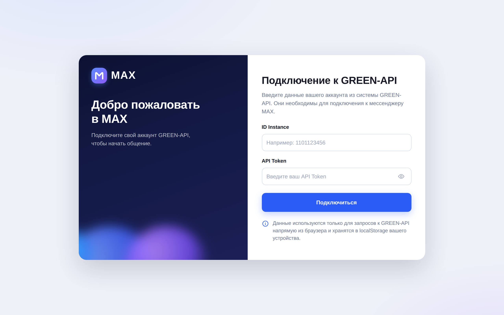
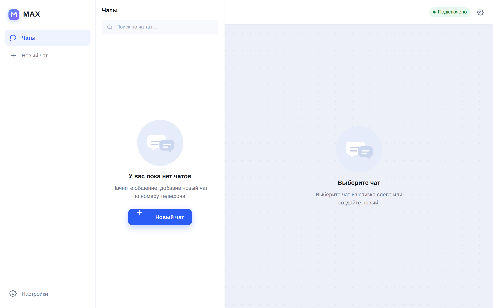
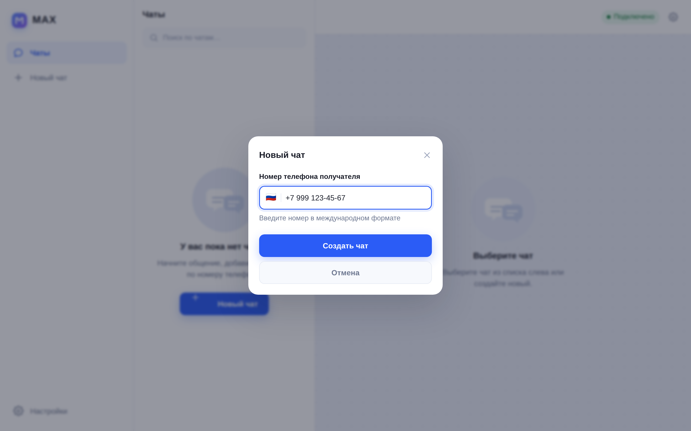
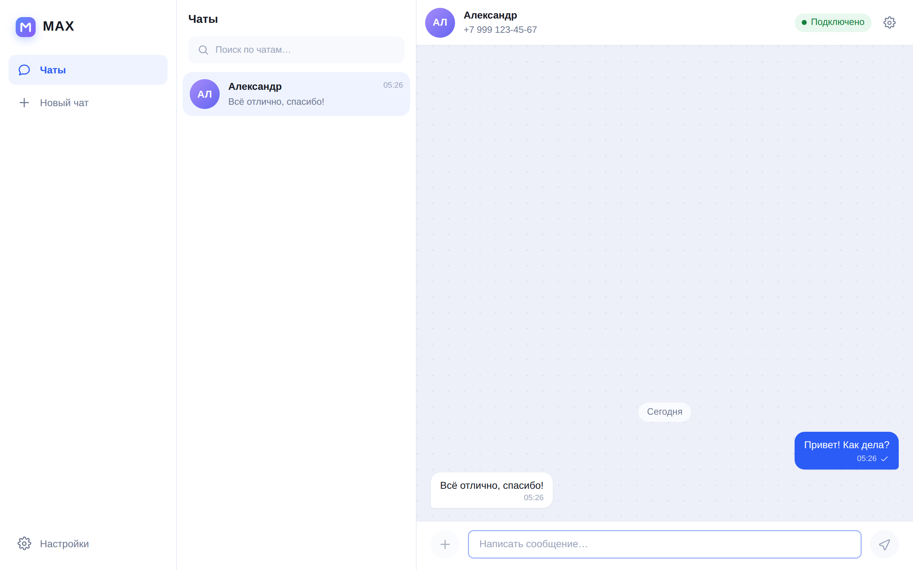

# MAX Chat — веб-клиент мессенджера MAX на GREEN-API

Интерфейс для отправки и получения текстовых сообщений в мессенджере [MAX](https://max.ru)
через [GREEN-API](https://green-api.com/max). Внешний вид взят за прототип с
[web.max.ru](https://web.max.ru).

Тестовое задание на позицию «Фронтенд разработчик React».



| Список чатов | Новый чат | Переписка |
| --- | --- | --- |
|  |  |  |

---

## Что умеет

- Подключение к инстансу GREEN-API по `idInstance` и `apiTokenInstance`.
- Создание чата по номеру телефона получателя (РФ `+7` и РБ `+375`).
- Отправка текстовых сообщений методом
  [`SendMessage`](https://green-api.com/v3/docs/api/sending/SendMessage/).
- Получение входящих сообщений через
  [HTTP API очереди уведомлений](https://green-api.com/v3/docs/api/receiving/technology-http-api/):
  цикл `ReceiveNotification` → обработка → `DeleteNotification`.
- Статусы исходящих сообщений (отправлено / доставлено / прочитано / ошибка) из вебхука
  `outgoingMessageStatus`.
- Счётчик непрочитанных, поиск по чатам, разделители дат, автоскролл ленты.
- Сессия и переписка сохраняются в `localStorage` — после перезагрузки страницы ничего не теряется.
- Адаптивная вёрстка: на узких экранах список чатов и переписка переключаются.

Согласно заданию поддерживаются **только текстовые** сообщения: входящие уведомления
других типов (`imageMessage`, `pollMessage` и т. д.) игнорируются.

---

## Быстрый старт

```bash
git clone <repository-url>
cd max-chat
npm install
npm run dev
```

Приложение откроется на <http://localhost:5173>.

### Что понадобится

1. Аккаунт в [личном кабинете GREEN-API](https://console.green-api.com).
2. Инстанс мессенджера **MAX** на тарифе «Разработчик» (бесплатный, до 3 чатов).
3. Авторизованный инстанс: состояние должно быть `authorized` (авторизация по QR-коду
   в личном кабинете).
4. **Пустое поле `webhookUrl`** в настройках инстанса. Если указан внешний адрес вебхука,
   очередь HTTP API не наполняется и входящие сообщения не приходят — приложение покажет
   об этом отдельное предупреждение.

На экране входа введите `idInstance` и `apiTokenInstance` из личного кабинета.

### Команды

| Команда | Действие |
| --- | --- |
| `npm run dev` | Дев-сервер с HMR |
| `npm run build` | Проверка типов и production-сборка в `dist/` |
| `npm run preview` | Локальный просмотр production-сборки |
| `npm test` | Прогон тестов (Vitest) |
| `npm run lint` | ESLint |
| `npm run typecheck` | Проверка типов без сборки |

---

## Как это работает

### Отправка

`SendMessage` вызывается с `chatId` получателя. Сообщение сразу появляется в ленте со
статусом «отправляется», после ответа API локальный идентификатор заменяется на `idMessage`
из ответа, а дальнейшие статусы приходят вебхуком `outgoingMessageStatus`.

### Получение

Пока сессия активна, работает длинный опрос очереди уведомлений:

```
GET  {apiUrl}/waInstance{id}/receiveNotification/{token}?receiveTimeout=10
     ↓ (уведомление получено)
     обработка: добавить сообщение / обновить статус / обновить состояние инстанса
     ↓
DELETE {apiUrl}/waInstance{id}/deleteNotification/{token}/{receiptId}
```

Без `DeleteNotification` то же уведомление вернётся снова, поэтому подтверждение
обязательно. При сетевых ошибках включается экспоненциальная пауза (3 → 6 → 12 → … → 30 с),
индикатор в шапке переключается на «Нет связи», а сообщение об ошибке показывается один раз,
а не на каждой итерации.

### chatId и номер телефона

В MAX сообщения отправляются по `chatId`, а не по номеру. При создании чата приложение
вызывает [`CheckAccount`](https://green-api.com/v3/docs/api/service/CheckAccount/) и получает
постоянный `chatId` — тогда входящие уведомления гарантированно попадают в тот же чат.

Если `CheckAccount` недоступен (например, MAX временно ограничил проверку номеров, HTTP 469),
чат всё равно создаётся, а отправка идёт по обратно совместимому идентификатору
`номер@c.us`. Постоянный `chatId` подставится из первого входящего уведомления: чаты,
найденные по номеру и по `chatId`, автоматически объединяются вместе с уже отправленными
сообщениями — за это отвечает `resolveChat` в `entities/chat`.

### Хранение

Учётные данные и переписка лежат в `localStorage` этого браузера и никуда больше не уходят:
запросы идут напрямую из браузера в GREEN-API, промежуточного бэкенда нет. При входе под
другим `idInstance` локальный кэш чатов очищается.

История переписки за прошлые сессии в очередь уведомлений не попадает — GREEN-API отдаёт
только новые события (журналы `GetChatHistory` в задании не требовались).

---

## Архитектура

Проект собран по [Feature-Sliced Design](https://feature-sliced.design): слои импортируются
строго сверху вниз — `app → pages → widgets → features → entities → shared`.

```
src/
├── app/                        каркас приложения, глобальные стили и дизайн-токены
├── pages/
│   ├── auth/                   экран подключения к GREEN-API
│   └── chat/                   основной экран мессенджера
├── widgets/
│   ├── app-sidebar/            левая навигация
│   ├── chat-list/              список чатов с поиском
│   └── chat-window/            шапка чата и лента сообщений
├── features/
│   ├── auth/                   подключение, восстановление и закрытие сессии
│   ├── create-chat/            создание чата по номеру (CheckAccount)
│   ├── send-message/           отправка текста (SendMessage) и поле ввода
│   ├── receive-notifications/  разбор вебхуков и длинный опрос очереди
│   └── instance-settings/      сведения об инстансе, очистка истории, выход
├── entities/
│   ├── session/                учётные данные и клиент GREEN-API
│   ├── chat/                   модель чата, слияние дубликатов, непрочитанные
│   └── message/                модель сообщения, статусы, пузырь сообщения
└── shared/
    ├── api/green-api/          типизированный HTTP-клиент и ошибки
    ├── lib/                    телефоны, даты, аватары, утилиты
    ├── config/                 константы приложения
    └── ui/                     кнопки, поля, модальное окно, тосты, иконки
```

### Стек

- **React 19** + **TypeScript** (strict) + **Vite 6**
- **Zustand** — состояние с сохранением в `localStorage`
- **CSS Modules** + дизайн-токены на CSS-переменных (без UI-библиотек)
- **Vitest** + **Testing Library** — модульные и компонентные тесты
- **ESLint** (flat config) + typescript-eslint

Сторонних UI-китов и HTTP-клиентов нет: иконки, модальное окно с ловушкой фокуса, тосты
и поля ввода написаны в `shared/ui`, запросы — на `fetch` с `AbortController`.

### Решения, которые стоит отметить

- **Слой API отделён от доменной логики.** `GreenApiClient` знает только про HTTP,
  `parseNotification` превращает вебхук в доменное событие, `applyNotification` применяет
  его к хранилищам. Каждый уровень тестируется отдельно.
- **Идемпотентность.** Сообщения дедуплицируются по `idMessage`, поэтому повторная доставка
  уведомления не создаёт дублей в ленте.
- **Порядок сообщений.** GREEN-API присылает время с точностью до секунды, локальные отметки —
  до миллисекунды. Сортировка идёт по секундам, а стабильная сортировка сохраняет порядок
  появления — исходящее сообщение не «перепрыгивает» за ответ, пришедший в ту же секунду.
- **Отмена запросов.** Опрос очереди останавливается через `AbortController` при размонтировании
  и при закрытии сессии, повторный запуск защищён от гонок.
- **Доступность.** Модальное окно с ловушкой фокуса и `Escape`, `aria-live` на ленте сообщений,
  видимые состояния фокуса, подписи для скринридеров у статусов сообщений.

---

## Тесты

```bash
npm test
```

49 тестов в 6 файлах:

| Файл | Что проверяет |
| --- | --- |
| `shared/lib/phone.test.ts` | нормализация, валидация, маска и форматирование номеров |
| `shared/api/green-api/client.test.ts` | построение URL всех методов, разбор ошибок API |
| `features/receive-notifications/lib/parse-notification.test.ts` | разбор всех типов вебхуков |
| `features/receive-notifications/model/apply-notification.test.ts` | привязка `chatId`, слияние чатов, дедупликация, непрочитанные |
| `features/send-message/model/send-message.test.ts` | оптимистичная отправка, фолбэк на `номер@c.us`, ошибки |
| `widgets/chat-list/ui/ChatList.test.tsx` | пустое состояние, поиск, выбор чата |

---

## Деплой

Сборка — статика, отдельный бэкенд не нужен.

**Vercel / Netlify:** команда сборки `npm run build`, каталог `dist`.

**GitHub Pages:** в репозитории есть workflow `.github/workflows/deploy.yml`.
Включите Pages в режиме «GitHub Actions» — при пуше в `main` сборка выполняется
с `VITE_BASE_PATH=/<repository-name>/` и публикуется автоматически.

```bash
VITE_BASE_PATH=/max-chat/ npm run build
```

---

## Известные ограничения

- Поддерживаются только текстовые сообщения — так требует задание.
- Номера только РФ (`+7`) и РБ (`+375`): это ограничение GREEN-API для MAX.
- Тариф «Разработчик» допускает не более 3 чатов; при превышении GREEN-API вернёт HTTP 466.
- Аватары рисуются из инициалов: метод `GetAvatar` не использовался, чтобы не выходить
  за рамки минимального набора функций.
- Учётные данные хранятся в браузере и передаются прямо в GREEN-API. Для продакшена
  запросы стоило бы проксировать через собственный бэкенд, чтобы токен не попадал в клиент.
